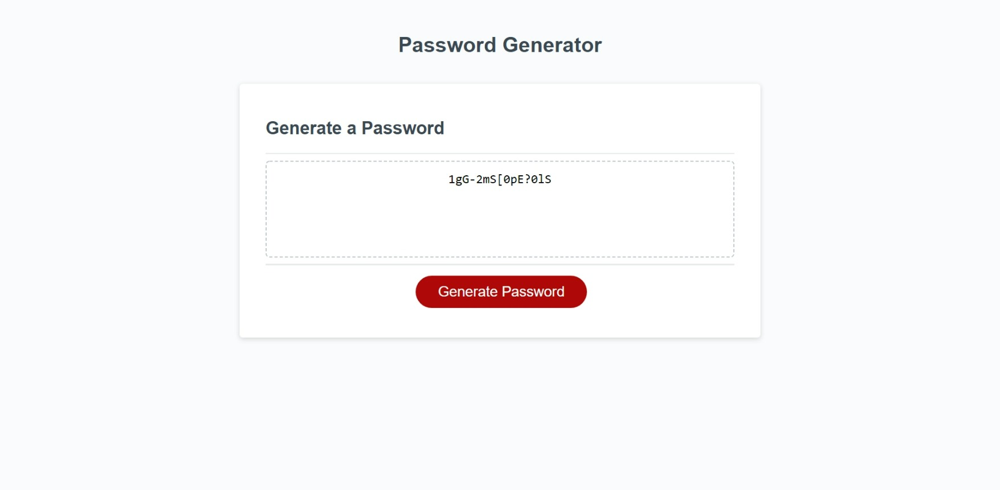

# Password Generator 

## Need a new secure password? We got it covered!

This repository contains the code for a user friendly password generator that runs within the browser soley based off JavaScript and minimal HTML/CSS

The user will be able to personalize their password by bhosing whether or not to include:
- Numbers
- Special characters
- Uppercase letters
- Lowercase letters

### [Access the site by this link!](https://chapmanh10.github.io/password-generator/)

